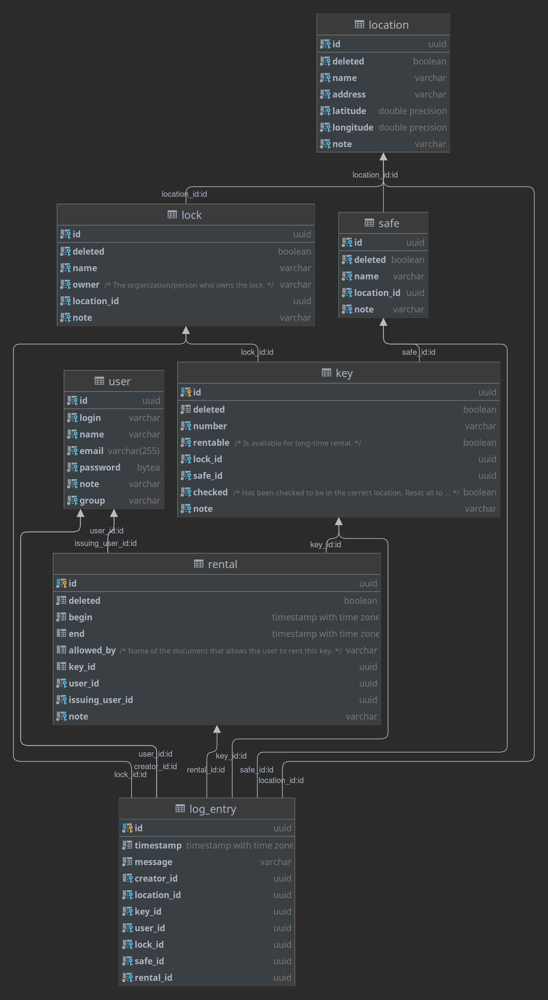
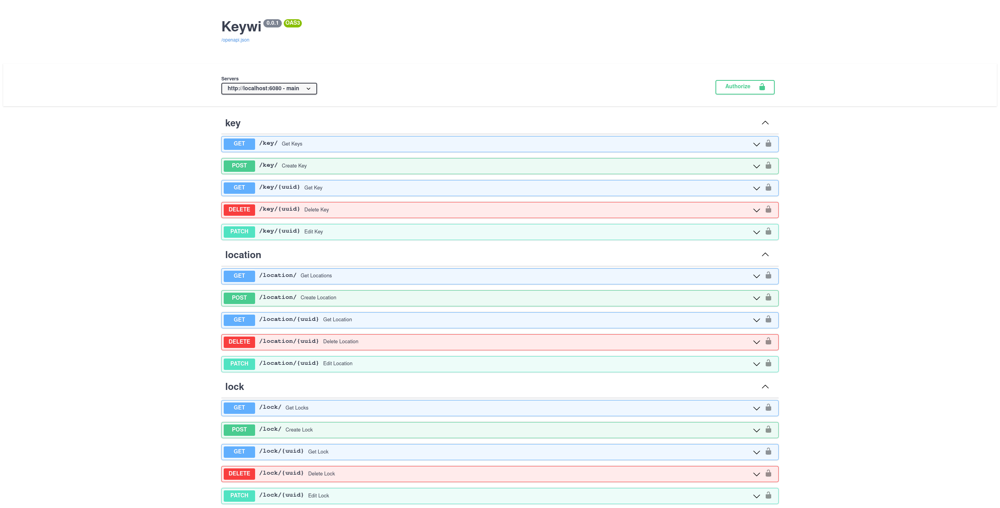
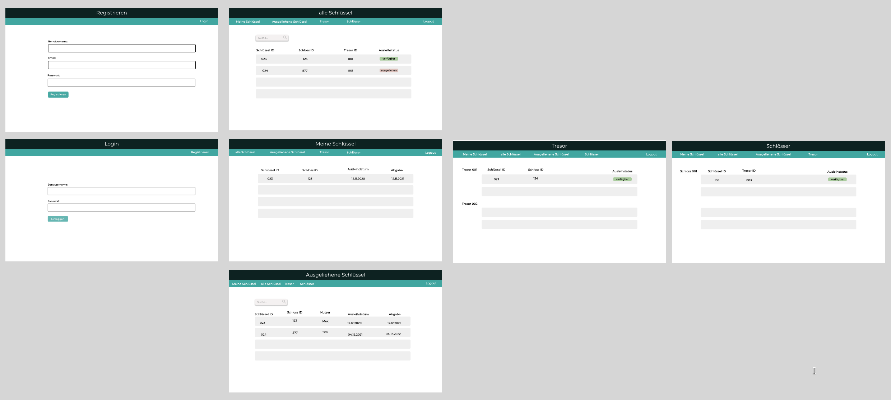
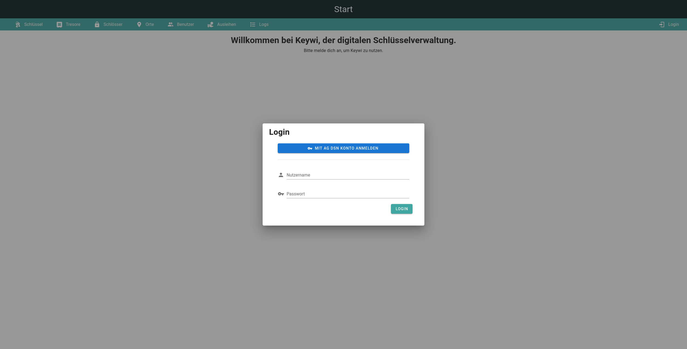
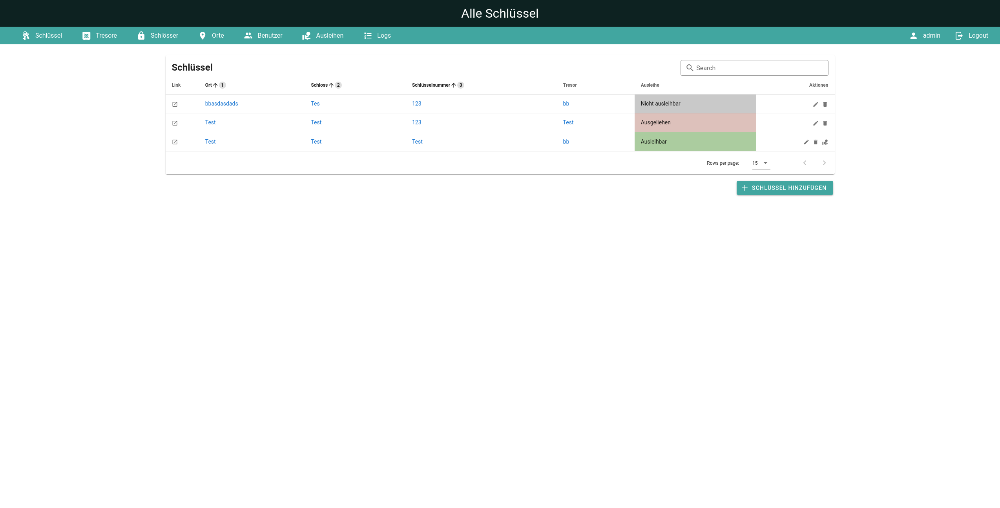
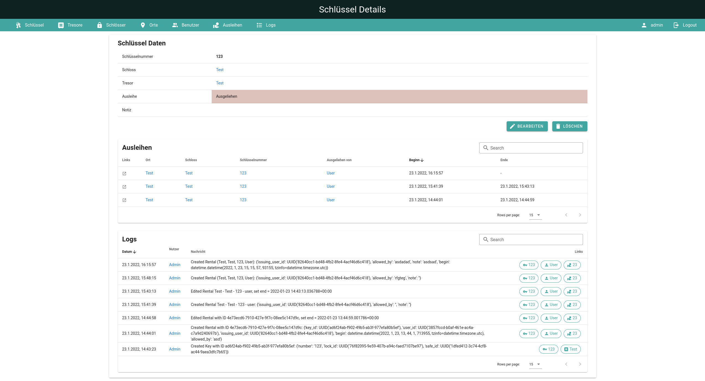
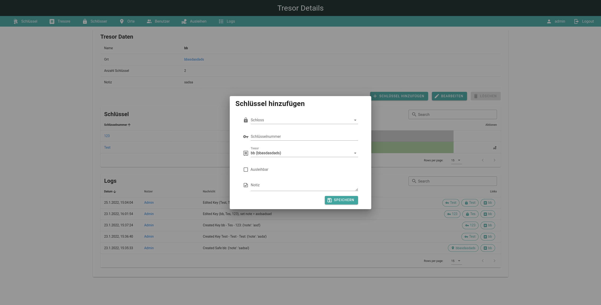

# Keywi Schlüsselverwaltung

## Projektmitglieder

1. Jakob Müller
2. Markus Richter

## Projektziel
Das Ziel ist die Erstellung einer Software zur Verwaltung von Schlüsseln (für Türen) und Schlüsselausleiehen.
Dabei soll die Anwendung in zwei Teile aufgeteilt werden: Einem Webservice und einem Client, der diesen verwendet.

Folgende Objekte sollen verwaltet werden können:

- Orte (Gebäude, ...)
- Tresore (Beinhalten Schlüssel, sind an einem Ort)
- Schlösser (Sind an einem Ort)
- Schlüssel (Gehören zu einem Schloss und sind in einem Tresor)
- Ausleihen (Schlüssel können von Benutzern für einen Zeitraum ausgeliehen werden)

Zur Nachvollziehbarkeit der Aktionen, sollen alle Vorgänge protokolliert werden.

Außerdem soll (zusätzlich zu einem lokalen Konto) eine Authentifizierung über einen externen OAuth2/OpenID Connect 
Provider möglich sein. Zur Verwaltung der Benutzungsrechte (wer darf einen Schlüssel ausleihen oder Daten bearbeiten), 
soll es verschiedene Benutzergruppen mit individuellen Berechtigungen geben.

### Anwendungsfall
Die Arbeitsgemeinschaft Dresdner Studentennetz (kurz AG DSN) betreibt das Netzwerk in allen Studentenwohnheimen 
in Dresden und Tharandt. Dafür werden zu allen Gebäuden/Technikräumen/Serverschränken/Büros Schlüssel benötigt,
welche in verschiedenen Schlüsseltresoren aufbewahrt werden und ggf. auch längerfristig an aktive Mitglieder der
AG DSN verliehen werden. Insgesamt geht es um mehr als 200 Schlüssel.

Das Tracking darüber, welche Schlüssel in welchem Tresor sind und an wen welcher Schlüssel verliehen wurde, findet aktuell
in Papierform statt. Dies führt zu Problemen bei der Übersichtlichkeit und Konsistenz. Daher soll diese Verwaltung
digitalisiert werden, was mit dem Projekt angegangen wird.

Mit der OAuth2 Schnittstelle sollen sich AG DSN Mitglieder bei dem System anmelden können und direkt die richtigen
Berechtigungen zugewiesen bekommen.

## Technische Umsetzung
Es wurde sich für eine Python FastAPI Anwendung im Backend und ein Javascript-Vue Frontend entschieden:

### Backend (Service)

Das Backend basiert auf Python 3.10 und einem PostgreSQL Datenbankserver.
Folgende Bibliotheken wurden verwendet:

- [FastAPI](https://fastapi.tiangolo.com/) (Schnelles REST-Framework, mit vielen nützlichen Features)
- [SQLAlchemy](https://www.sqlalchemy.org/) (Datenbankanbindung, ORM)
- [pydantic](https://pydantic-docs.helpmanual.io/) (API Models, Validation)
- [Authlib](https://docs.authlib.org/en/latest/) (OAuth2/OpenID Connect)

Eine grafische Darstellung aller Abhängigkeiten ist im Repository unter `documentation/pip-dependencies.png` zu finden.

#### Datenbankmodell

Das Datenbankmodell wurde über SQLAlchemy definiert. Nachfolgend ist ein UML Diagramm zu sehen.

#### Schnittstellenspezifikation
FastAPI generiert automatisch eine OpenAPI Schnittstellendefinition. 
Eine interaktive Swagger-Doku ist im Repository unter `documentation/swagger.html` zu finden.

Auszug aus der Swagger-Doku:

#### Authentifizierung und Autorisierung
Es gibt zwei Wege sich gegenüber der API zu authentifizieren:

1. Benutzername und Passwort (lokale Nutzerdatenbank)
2. OpenID Connect Login (AG DSN Nutzerdatenbank)

Bei Option 1 werden dem Nutzer die Berechtigungen zugewiesen, die für die Gruppe in der `group` Spalte des Nutzers 
festgelegt wurden.

Bei Option 2 werden die Gruppen vom OpenID Connect zu Keywi Gruppen übersetzt. Sollte ein Nutzer in mehreren Gruppen
sein, erhält dieser die Vereinigung aller Berechtigungen der entsprechenden Gruppen.

In beiden Fällen wird ein JWT Token generiert, welcher die entsprechenden Berechtigungen (`scopes`) enthält. Dieser
Token wird dann an den Nutzer gegeben, wodurch dieser sich bei zukünftigen Anfragen authentifizieren kann.

### Frontend (Client)
Das Frontend basiert auf TypeScript, Webpack und Vue 2.
Folgende Bibliotheken wurden verwendet:

- [Vuetify](https://vuetifyjs.com/en/) (Design framework)
- [OpenAPI Client Axios](https://www.npmjs.com/package/openapi-client-axios) (Generiert API-stubs aus openapi.json)
- [Material Design Icons](https://materialdesignicons.com/)

Eine Auflistung aller Abhängigkeiten ist im Repository unter `documentation/npm-dependencies.txt` zu finden.

#### Mockup
Vor der eigentlichen Entwicklung des Frontends wurde ein Mockup erstellt, welches als Vorlage bei der Entwicklung diente:

#### Screenshots
Die folgenden Screenshots geben einen groben Einblick in das fertige Frontend:

*Login*

*Schlüsselübersicht*

*Schlüssel Details*

*Tresorübersicht / Schlüssel erstellen*

#### Bedienung
Die Bedienung der Anwendung ist intuitiv und bedarf keiner weiteren Erklärung.

## Deployment

### Backend
Für das produktive Deployment wird Docker verwendet. Dafür gibt es zwei wichtige Dateien:

- `backend/docker/prod-app.Dockerfile`: Dockerfile für das Produktiv-Image.
- `backend/docker-compose.prod.yml`: Docker compose Datei, welche dieses Image verwendet.

Die Docker compose Datei beinhaltet zwei Services:

- Keywi Backend (API)
- PostgreSQL Server

Letzterer kann optional auch weggelassen werden, falls bereits ein PostgreSQL-Server vorhanden ist.

### Frontend
Mit dem Befehl `npm build` kann das Frontend gebaut werden. Dadurch erhält man statische HTML/CSS/JavaScript Dateien.

### Auslieferung von Frontend und Backend
Um nun beide Komponenten zusammen auszuliefern, wird der Webserver `nginx` verwendet.
Dieser wird so konfiguriert, dass `/` (also bspw. `https://keywi.agdsn.de/`) das Frontend ausliefert, während
unter `/api/` (also bspw. `https://keywi.agdsn.de/api/`) das Backend erreichbar ist.

In der Konfigurationsdatei des Frontends muss dann nur noch die korrekte Backend-URL hinterlegt werden.

Für ein gültiges HTTPS-Zertifikat wird Certbot bzw. Letsencrypt verwendet.

## Projektverlauf
Bei Projektgruppentreffen wurden Protokolle verfasst. Diese sind im Repository im Ordner `/protocols` auffindbar.
